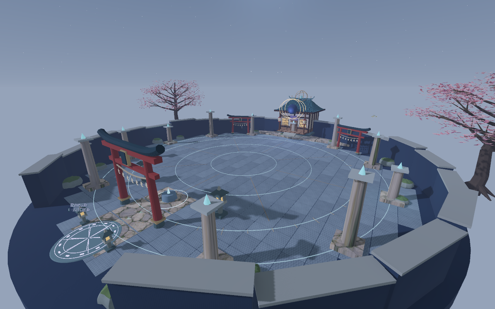
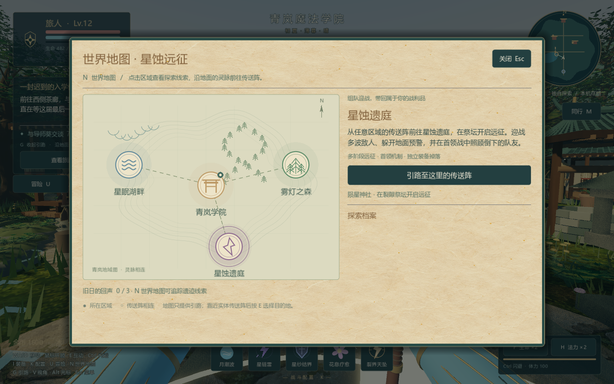
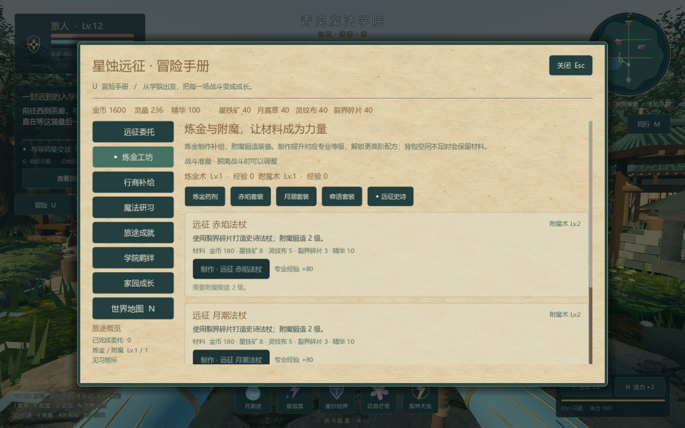

# 结界之庭 · Spellgarden

## Unreal Engine 5 · 技能与体验更新

**v0.7.1 UE5 Preview · Unreal Engine 5.8.3 · Windows x64**

[下载 UE5 Windows 游戏包](https://github.com/chuanyu657-ship-it/spellgarden/releases/download/v0.7.1-ue5-preview/Spellgarden-UE5-v0.7.1-preview-Windows-x64.zip) · [发行说明与校验文件](https://github.com/chuanyu657-ship-it/spellgarden/releases/tag/v0.7.1-ue5-preview)

约471 MB，完整解压后打开 `Spellgarden.exe`，无需 Unreal 编辑器。包含第一人称四区探索、法术与脚下魔法阵、装备成长、天赋、制作、委托和家园。

本次修复默认技能未解锁、灵藤落点偏移；新增一次学习并装备、直接交换技能槽、明确施法失败原因、0.35秒衔接、按住火冰攻击、真实星链雷电、元素特效区分，以及可保存的画质设置。兼容修复旧 UE 角色已装配的基础技能，不重置其他进度。

成品包通过九技能/输入96、成长41、战斗18、主机22与客机17项原生检查，八张实机截图已目视检查。联机为同机两个独立进程验证；按 M 创建/加入同局域网或虚拟局域网房间，上限四人，朋友都需要 v0.7.1。尚未验证跨电脑公网或四人压力，没有公网大厅或中继。

这是 UE5 开发预览：完整骨骼动作、动态环境和部分学院剧情仍待完善；Godot 存档不自动转入 UE，客机成长仅限当前房间。下方 Godot v0.6.0 的功能说明仅对应原版本。旧版下载均保留。

---

## Godot v0.6.0 · 星蚀远征

**星蚀远征：探索故事，组队下本，带回新的魔法装备。**

日式魔法学院题材的 Windows 冒险游戏，默认第一人称，也可切换第三人称。支持单人和最多四人 ENet 合作。这次更新围绕战斗刷装、副本、探索剧情和世界地图，把成长、制作与挑战连接起来。

[下载 Windows 完整包](https://github.com/chuanyu657-ship-it/spellgarden/releases/download/v0.6.0/Spellgarden-v060-Windows.zip) · [发行页](https://github.com/chuanyu657-ship-it/spellgarden/releases/tag/v0.6.0)

## 本次新增

- **第四区域「星蚀遗庭」**：日式神社、环形战斗场、石板材质、星盘、灯火与传送阵。
- **可重复副本「陨星神社」**：三波守卫之后挑战「裂星司祭 · 朔夜」，生命降至 66% / 33% 转入新阶段。地面预警、星蚀安全圈和交叉落点需要主动躲避。
- **三档难度与独立战利品**：星辉 / 残月 / 蚀日首领分别保证 1 / 2 / 3 件史诗以上装备，最低装等 6 / 10 / 15，另有金币、经验、裂界碎片。副本生命随开局参与人数提高。
- **探索剧情**：学院、雾林、星湖各有一段可阅读的遗迹记忆。三段记忆与副本结局连接，保留已有八阶段学院序章。
- **N 世界地图**：四个区域、探索档案、线索追踪。地面导航引导到当前区域的传送阵，抵达后继续引向记录或祭坛。
- **U 冒险手册**：五类可重复委托、八项成就、金币与材料、补给商店、装备出售、炼金与附魔、九种法术熟练度、NPC 羁绊奖励与三级家园升级。
- **定向制作**：18 个稀有套装部位配方、3 个远征史诗法杖配方，以及两种药剂；野外六处新增可再生材料点。
- **战斗操作与合作救援**：Ctrl 闪避消耗体力并有短暂无敌，F / H 使用共享 12 秒冷却的生命 / 法力药剂；联机倒地后队友靠近按 E 救援，18 秒后自动回本区入口。
- **画质设置**：Esc 中切换流畅、均衡、高画质；兼容模式继续支持 OpenGL。

原有六部位装备、五档品质、随机词条、三套套装、强化 +5、分解、八选四技能、大招、元素连携、天赋、NPC 好感、建家与种植继续保留。升级及施法保留脚下法阵。

## 启动与联机

完整解压 ZIP 后运行 `Spellgarden.exe`，保留同目录 `.pck`、`.dat` 和附带文件；无需安装 Godot 或 Blender。无法显示时运行 `Start-Compatible.cmd`。

全队请使用 **v0.6.0**。同一局域网，或已加入同一虚拟局域网的朋友，由房主按 M 建房、复制可达地址的邀请，朋友粘贴加入。房主需持续在线；个人成长各自保存，房间建筑由房主保存。详细步骤见包内《联机快速开始》。

旧存档继续读取并自动补齐新字段；新旧发行目录分别保留。测试均使用隔离角色，没有读取或覆盖个人存档。

## 操作

| 操作 | 按键 |
| --- | --- |
| 移动 / 奔跑 / 跳跃 | WASD / Shift / Space |
| 瞄准 / 临时显示光标 | 移动鼠标 / 按住 Alt |
| 第一、第三人称切换 | V |
| 普通技能 / 大招 | 1–4 或左键第1技能 / Q |
| 闪避 / 生命药剂 / 法力药剂 | Ctrl / F / H |
| 互动、阅读、采集、传送、救援 | 靠近按 E |
| 世界地图 / 冒险手册 | N / U |
| 背包与装备 / 技能搭配 | I / K |
| 学习魔法 / 天赋 / 家园 | Tab / T / B |
| 学院任务 / 地面引路 / 联机 | J / G / M |
| 设置与保存退出 | Esc |

菜单不会暂停敌人。先脱战再制作、换装和调整技能。世界地图提供导航，传送需到实体传送阵操作。

## 验证与当前边界

本次已通过：新成长 79 项、旧装备 372 项、新主场景流程 62 项、旧战斗 42 项、新界面 42 项及实际场景 16 项、旧装备界面 36 项、副本逻辑 32 项、真实副本联机 33 项、四进程新协议 155 项、四人跨地图 101 项，以及剧情、采集点、章节与导航回归。

这是可玩的四人合作版本，距离商业大型 MMORPG 的内容量与制作规格仍有差距。没有大规模持久服务器、公网匹配、中继、玩家拍卖或账号体系。联机已用本机独立进程测试，不同物理设备之间的异地连接仍待实测。

美术为本项目自有制作，Witchbrook 仅作氛围参考，未使用其游戏素材。引擎及附带运行库许可见游戏包。

正式 Windows EXE 的 Vulkan 展示与 OpenGL 兼容运行均通过。已无需登录重新下载公开 ZIP，检查 CRC、全部文件 SHA-256，并从全新解压目录运行 EXE 冒烟，全部通过。

