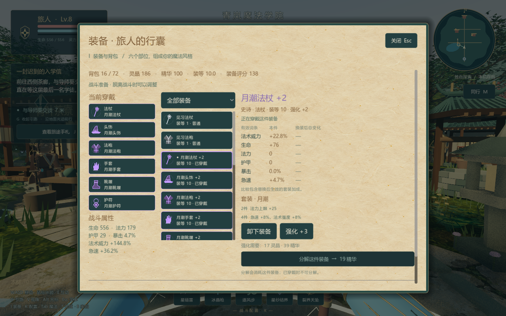
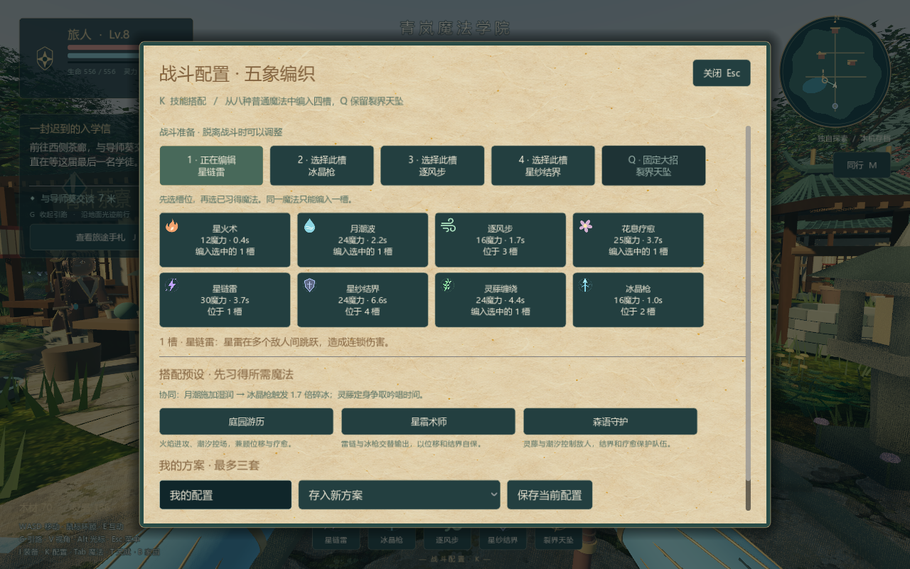
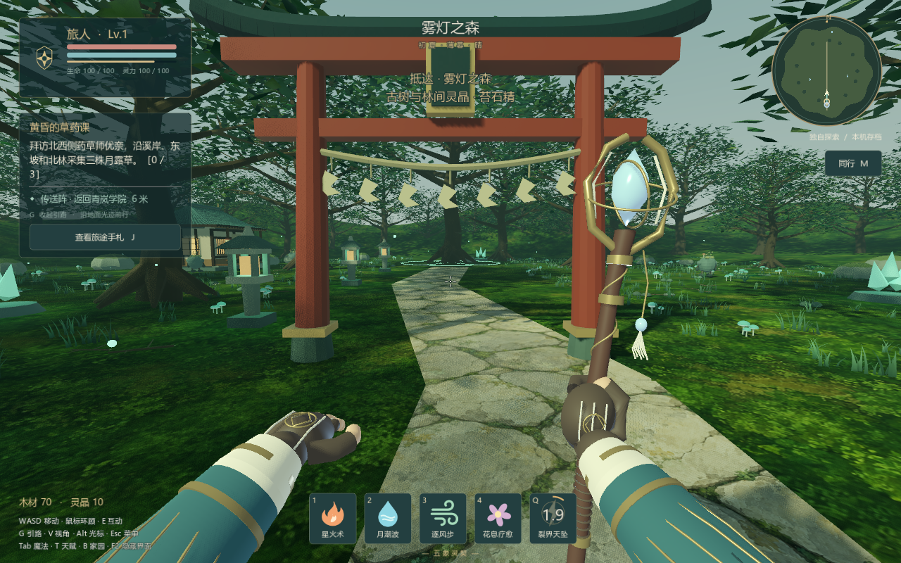

# 结界之庭 · Spellgarden v0.5.0

日式魔法学院题材的 Windows 四人合作冒险原型：学习魔法、结识导师、探索三境、挑战守护者，在庭院建家。v0.5.0 加入装备成长、套装和元素连招。

[下载 Windows 完整游戏包](https://github.com/chuanyu657-ship-it/spellgarden/releases/download/v0.5.0/Spellgarden-v050-Windows.zip) · [查看最新发行版](https://github.com/chuanyu657-ship-it/spellgarden/releases/latest)

下载 ZIP，完整解压后运行 `Spellgarden.exe`；保留同目录的 `.pck` 与 `.dat` 文件。无需安装 Godot 或 Blender。默认 Vulkan，无法正常显示时运行 `Start-Compatible.cmd`。旧角色存档可继续使用。

## 装备与技能

- **I 装备**：法杖、头饰、法袍、手套、靴履、护符六部位；五档品质、随机词条、装等、换装比较、强化至 +5 与分解精华。
- **三种套装**：赤焰、月潮、森语的两件与四件加成，实际影响生命、法力、威力、护甲、暴击和急速。
- **K 技能配置**：八个普通技能中选四个，Q 固定裂界大招；三套预设和最多三套自定义技能方案。Tab 学习魔法。
- **元素协同**：水雷感电、水冰碎冰、火风燎原，藤蔓控制与附近队友护盾；每次施法与成长仍有脚下法阵。
- **个人掉落**：附近队友各自获得奖励；外区精英保证稀有以上，首领保证史诗以上。满背包的新装备自动分解。
- **战斗限制**：脱离敌人并等待五秒后调整配装；换装不回满血蓝、不重置技能冷却。

## 和朋友联机

1. 全员更新到 **v0.5.0**，最多四人。
2. 同一局域网可直接连接。异地朋友可加入同一个 [Radmin VPN](https://www.radmin-vpn.com/) 网络。
3. 房主按 **M** 创建庭园，选择可达地址并复制邀请；朋友按 **M** 粘贴后加入。
4. Windows 防火墙阻挡时，参考包内《联机快速开始》，使用仅针对本游戏的 UDP 24567 网络助手。

房主需要保持游戏在线。个人成长各自保存，房间建筑由房主保存。邀请提供连接地址，不会自动建立 VPN 网络。

## 学院生活与探索

第一人称双手施法，V 可切换第三人称；导师任务感叹号、地面绕障引路、可完成的学院序章、NPC 好感、天赋与派系，以及采集、花圃与家园。学院、雾灯之森、星眠湖畔通过传送阵往返。

WASD 移动 / Shift 奔跑 / Space 跳跃；鼠标瞄准；按住 Alt 显示光标。

E 互动与传送 / 1–4 普通技能 / Q 大招 / I 装备 / K 技能配置 / Tab 魔法书 / T 天赋 / J 任务 / G 引路 / B 建家 / M 联机 / Esc 菜单。

这是可玩的合作原型，采用 MMORPG 常见的配装与技能组合思路。当前没有大型 MMO 服务器、公网匹配或内置中继，跨网络连接依赖可达地址或虚拟局域网。验证包含同机四进程 ENet，尚未进行不同物理电脑的异地测试。

发布包附带运行库的第三方许可。Witchbrook 仅为氛围参考，未使用其游戏素材。
